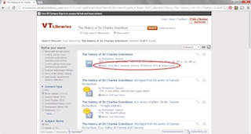

# How to request an available book from the Virginia Tech Library {.task}

The Virginia Tech Library offers many different resources including books, journals, and databases. Available sources are easiest to access, and can be requested via the library website.

1.   Navigate to the Virginia Tech Library page and search for your desired book in the Summon search bar.

    

2.   Once results appear, locate the desired book and check its availability.
 
    If available, under the title and description of the book, you will see an *Available* label and the location of the book.

    

3.   Click on the title of your desired book.

    You can also check the availability of a book with its location and call number.

    
4.   At the top of the screen, click the green check mark to proceed with the request process.

    You may also view the location of the book in the library and pick it up yourself by checking out at the circulation desk.

     
5.   Log in with your name and student ID number.

    Do not use your PID or password in this window.

6.   Choose your pickup location.

    At this time, you may choose to use the Book Runner service for participating departments.

    

7.   Enter any special notes for your request and choose a date to cancel your request if you do not pick the book up.

    The default cancellation is 90 days from the date of request.

8.   Click *submit* at the bottom of the page.

9.   If applicable, select the appropriate volume from the multiple choice list before final submission.
    1. Click *submit* to complete your request.
10.   Check your *My Library* account for a status update on your request.

    **On holdshelf** means that your requested item is probably waiting for you at your chosen pickup location.
    