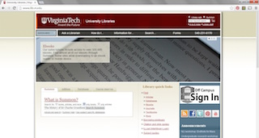

# How to request a checked out book from the Virginia Tech Library #

The Virginia Tech Library ensures that resources like journals and books are made available to anyone who requires the information. Resources that have been checked out can still be requested and made available to those who need them.

1. Navigate to the Virginia Tech Library page and search for your desired book in the *Summon* search bar.

2. Once results appear, locate the desired book and check its availability. 
    If the book is checked out, under its title and description you will see *DUE* and the date it is due back to the library.
  
3. Click on the title of your desired book.
    You can also check the availability or due date of the book with its location and call number.
    
4. At the top of the screen, click the green check mark to proceed with the request process.
    You may also view the location of the book in the library and pick it up yourself by checking out at the circulation desk.
  
5. Log in with your name and student ID number.
6. Choose your pickup location.
    At this time, you may choose to use the Book Runner service for participating departments.

7. Enter any special notes for your request and choose a date to cancel your request if you do not pick the book up.
    The default cancellation is 90 days from the date of request.
8. Click *submit* at the bottom of the page.
9. Click *submit* to complete your request of the selected item
    1. If applicable, select the appropriate volume from the multiple choice list before final submission.
    Recalled items are due back 21 days from the date of the submitted request or by the due date, whichever comes first.

10. Check your *My Library* account for a status update on your request
    **On Holdshelf** means that your requested item is probably waiting for you at your chosen pickup location.