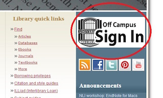
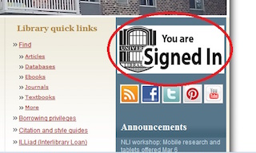

# How to use the Virginia Tech Library's Off Campus Sign In feature #

Off Campus Sign In is an authentication system that you must use in order to gain access to some of the Library's restricted resources when you are not connected to the VT network. You must sign in with your PID and password to show that you are affiliated with VT to be granted access to databases, ebooks, ejournals, and selected VT electronic theses and dissertations. You must be a current or retired VT faculty or staff member or a currently enrolled VT student registered in degree or credit courses with VT to have access to all of these resources.

1. Access the VT library homepage from your computer or other mobile device at <http://www.lib.vt.edu>

2. Locate the white box that says *Off Campus Sign In* and click on it.
 
3. Enter your PID and password to gain access to all Virginia Tech resources.
4. The *Off Campus Sign In* button should now read *You are signed in*.
  
    If this does not happen, you have not been signed in and cannot access restricted resources. You have likely been disconnected and you will need to try signing in again.
    
    Also, you can check the URL to make sure you are signed in if you cannot tell from the webpage. The Off Campus Sign In links will contain the string *ezproxy.lib.vt.edu* in the URL.

5. Once you are signed in, navigate to restricted resources through this browser window.
    If you just navigate to the resources in another browser window, then the Off Campus Sign In service will not work.
    